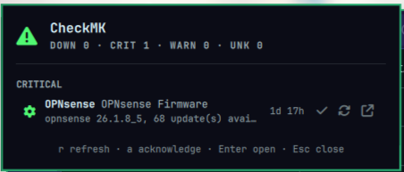

# CheckMK

Omarchy bar widget that supervises a remote **CheckMK** instance via its REST
API. The bar shows a global alert counter coloured by the worst state, and
left-clicking opens a panel with the list of hosts and services in anomaly.



## Install

```sh
omarchy plugin add https://github.com/OverStyleFR/omarchy-checkmk.git --enable
```

If the bar does not pick it up automatically:

```sh
omarchy restart shell
```

## Setup

Create the credentials file for your CheckMK automation user:

```sh
mkdir -p ~/.config/tomv.checkmk
cat > ~/.config/tomv.checkmk/.env <<EOF
CHECKMK_USERNAME=automation
CHECKMK_SECRET='your-automation-secret'
EOF
chmod 600 ~/.config/tomv.checkmk/.env
```

> Use single quotes around the secret if it contains special characters such as
> `%` or `)`.

Set your CheckMK site URL:

```sh
omarchy bar set tomv.checkmk baseUrl https://checkmk.example.com/monitoring
omarchy restart shell
```

Replace `monitoring` with your actual CheckMK site name.

## Usage

Click the widget to open or close the panel. With the panel open:

- `Escape` closes the panel.
- `r` refreshes the problem list.
- `a` acknowledges the selected problem.
- `Enter` opens the selected host/service in CheckMK.
- Right-click on the bar widget also refreshes.

The panel groups problems by state (critical, down, warning, unknown,
unreachable) and shows host, service, plugin output and duration.

### Acknowledge

Select a problem and press `a` or click the checkmark icon. The comment is
taken from the `acknowledgeComment` setting.

### Recheck / reschedule

The public CheckMK REST API does **not** expose a reschedule/recheck endpoint.
Use **Open in CheckMK** and click the Reschedule action there.

## Configure

Move the widget in your bar:

```sh
omarchy bar move tomv.checkmk --section right
```

Available settings (set with `omarchy bar set`):

| Setting | Default | Meaning |
|---|---|---|
| `baseUrl` | `https://checkmk.example.com/monitoring` | CheckMK base URL |
| `apiVersion` | `1.0` | REST API version segment |
| `refreshIntervalSec` | `30` | Polling interval |
| `showAcknowledged` | `false` | Include acknowledged problems |
| `maxItemsInPanel` | `50` | Max problems shown in the panel |
| `useHostAlerts` | `true` | Include host DOWN/UNREACHABLE |
| `useServiceAlerts` | `true` | Include service CRIT/WARN/UNKNOWN |
| `acknowledgeComment` | `Ack from Omarchy bar` | Default acknowledge comment |

Example:

```sh
omarchy bar set tomv.checkmk refreshIntervalSec 60 --json
omarchy bar set tomv.checkmk showAcknowledged true --json
omarchy bar set tomv.checkmk acknowledgeComment "Ack via Omarchy"
```

Use `--json` for booleans and numbers. Restart the shell after changing them:

```sh
omarchy restart shell
```

## Remove

```sh
omarchy plugin remove tomv.checkmk
```

Removing the plugin does not delete `~/.config/tomv.checkmk/.env`.

## Dependencies

- `curl` and `jq`.
- CheckMK automation user with:
  - `Monitoring user` role for reading host/service status.
  - Acknowledge permission for the acknowledge action.

## License

MIT — see [LICENSE](LICENSE).
